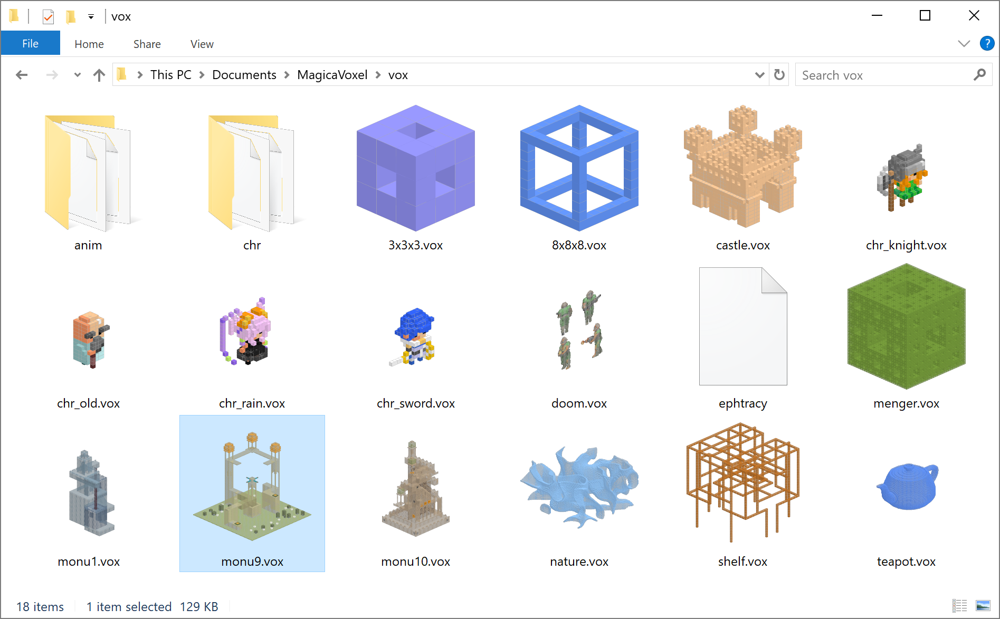
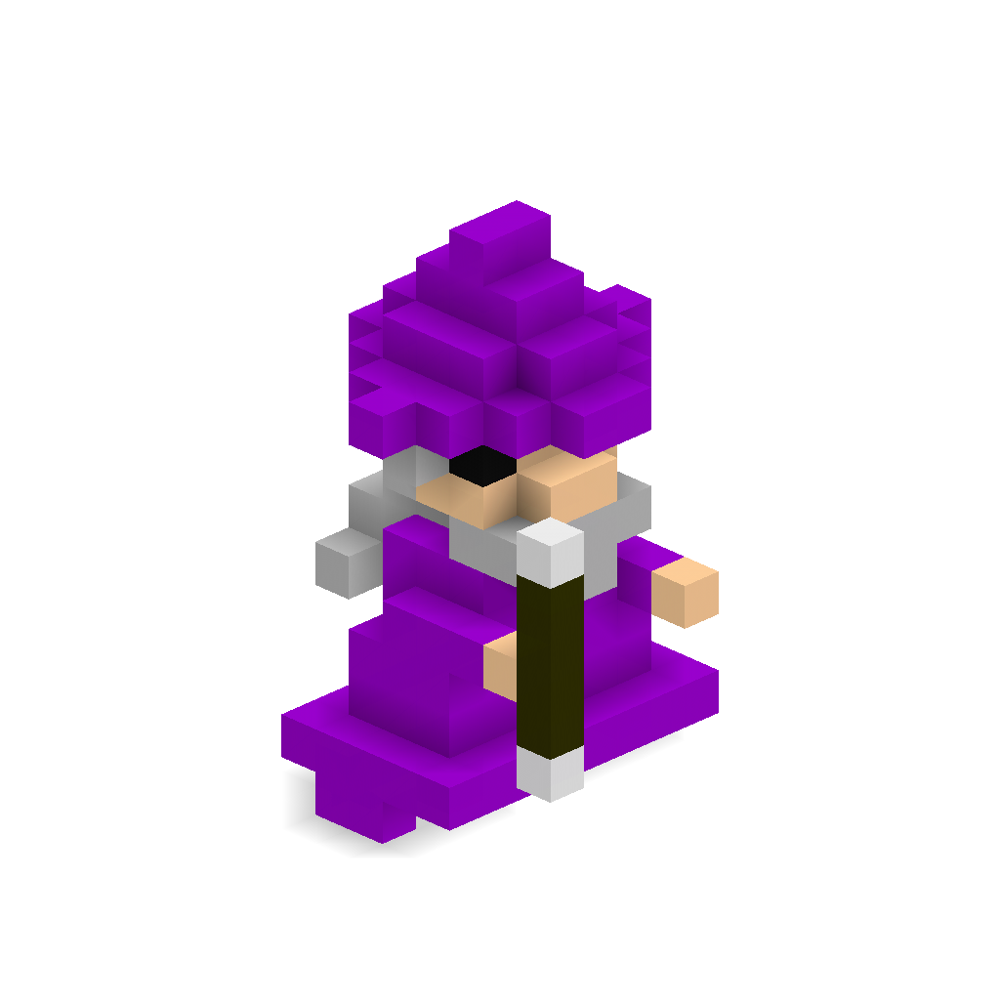

# Voxels

C# utilities for reading/writing/rendering [MagicaVoxel](https://ephtracy.github.io/) [.vox files](https://github.com/ephtracy/voxel-model/blob/master/MagicaVoxel-file-format-vox.txt).

# Windows Explorer Thumbnails

The [Voxels.Installer.msi](https://github.com/Arlorean/Voxels/releases/download/v1.0.0.2/Voxels.Installer.msi) provides Windows Explorer Thumbnails for MagicaVoxel .vox files:

# PNG and SVG output

The Voxels.CommandLine tool converts .vox files to .png and .svg. Here is my example [wizard.vox](Voxels.CommandLine/wizard.vox) file converted:

PNG             |  SVG
----------------|-------------------------
  |  

# Quick Build

1. Install ``Visual Studio 2017``
1. Open ``Voxels.sln``
1. Set ``Voxels.CommandLine`` as the startup project
1. Press ``Start`` in Visual Studio 2017
1. Open Windows Explorer on the ``Voxels.CommandLine\bin\Debug directory``
1. There should be two new files: ``wizard.png`` and ``wizard.svg``

# Installer Build

1. Install ``Visual Studio 2017``
1. Open ``Voxels.sln``
1. Install [WiX Toolset](http://wixtoolset.org/) v3.11
1. Install [Wix Toolset Visual Studio 2017 Extension](https://marketplace.visualstudio.com/items?itemName=RobMensching.WixToolsetVisualStudio2017Extension)
1. Build ``Voxels.Installer`` to create the [Voxels.Installer.msi](https://github.com/Arlorean/Voxels/releases/download/v1.0.0.2/Voxels.Installer.msi) setup file. 

# Third Party Components

1. [SkiaSharp](https://github.com/mono/SkiaSharp) - Xamarin C# wrapper for Google's Skia 2D rendering library
1. [SharpShell](https://github.com/dwmkerr/sharpshell) - Dave Kerr's ShellExtensions Library for .NET
1. [SharpShellTools](https://github.com/dwmkerr/sharpshell) - Dave Kerr's ShellExtensions Tools for .NET
1. [WiX Toolset](http://wixtoolset.org/) - ~~Simple~~ XML based windows installer scripting

The 3x3x3.vox, 8x8x8.vox files are directly from the [MagicaVoxel](https://ephtracy.github.io/) distribution for authentic testing.

# TODO

* Add shell context menus to export PNG/SVG interactively 
